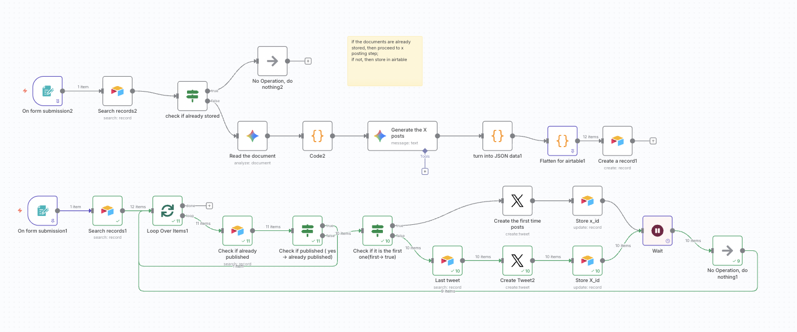
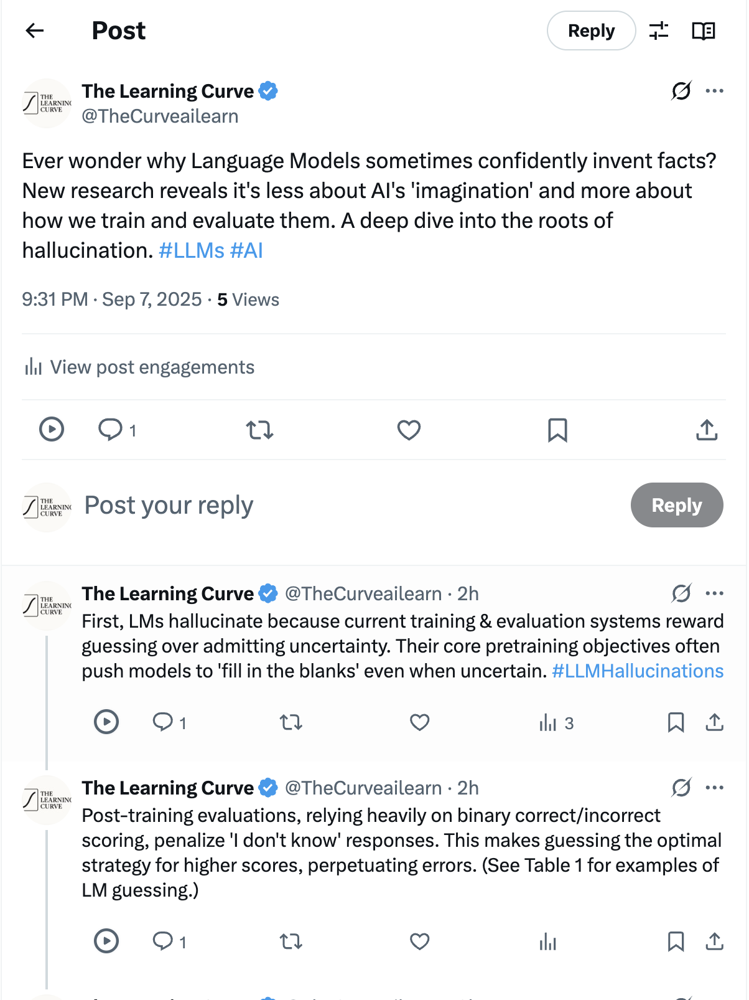
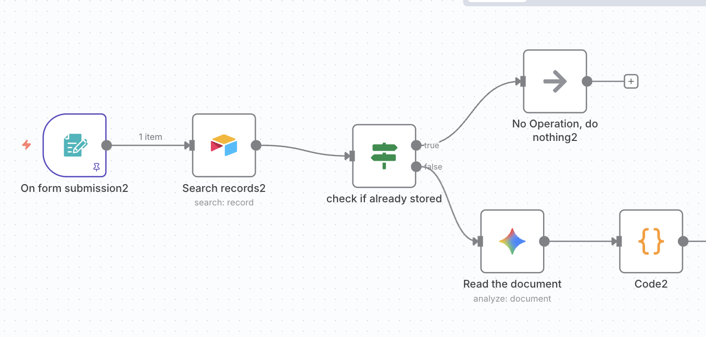
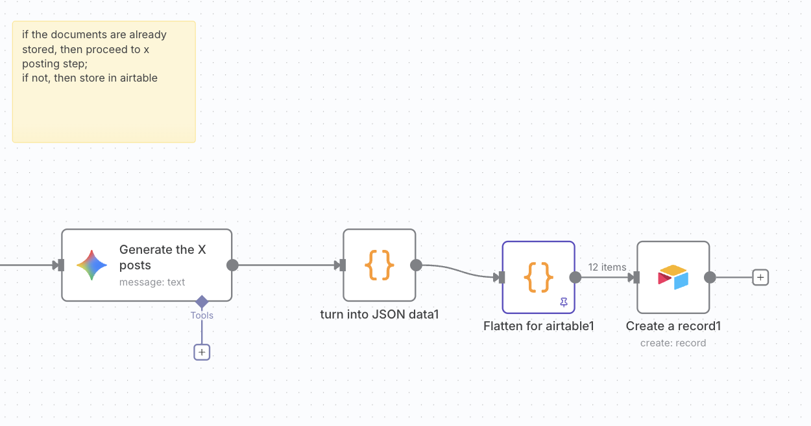
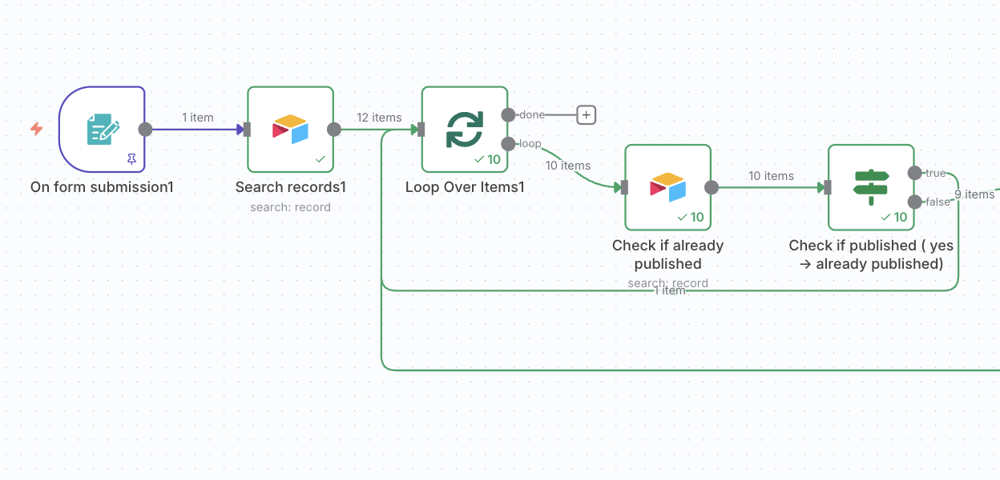
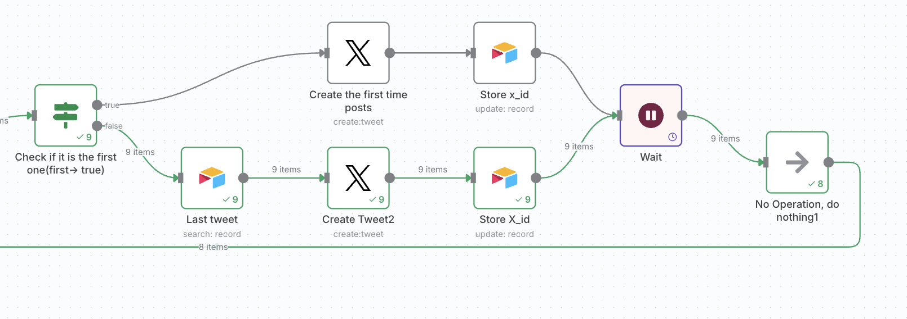

# 🚀 Academic Paper to Twitter Threads n8n Workflow


*A high-level look at the complete workflow, from PDF to published thread.*

When I tried to find an n8n workflow that turns academic papers into Twitter threads, I couldn't find the right solution. Other n8n workflows only focus on creating a single, generic post. However, what I wanted was a **thread**: a series of X posts with each subsequent one replying to the previous one.

So, I built this.

This workflow uses a two-agent AI system to create high-quality content.

1.  **The Research Agent**: Its only job is to read and process the paper, extracting key arguments and data into a structured format.
2.  **The Copywriting Agent**: It takes the structured output from the researcher and focuses purely on crafting an engaging, clear, and hook-driven Twitter thread.

This separation is better than a single-step process because it allows each AI agent to excel at its specific task. The researcher focuses on factual accuracy without being distracted by creative writing, while the copywriter can focus on engagement without needing to re-read the source material. This leads to content that is both more accurate and more compelling.

## 🧠 Core Features

-   🤖 **AI-Powered Analysis**: Leverages Google Gemini to read and deeply understand a PDF, extracting key arguments, data, and highlights.
-   ✍️ **Expert-Level Copywriting**: A second AI step, acting as a social media pro, transforms the analysis into a polished, hook-driven Twitter thread.
-   🗄️ **Content Hub & Cache**: Uses Airtable as a central database to store, review, and manage all generated tweets before and after publishing.
-   🛡️ **Fault-Tolerant Publishing**: The workflow is designed to be resilient. If publishing stops in the middle (e.g., due to an API rate limit), you can fix the issue and restart the job without creating duplicate posts. It picks up right where it left off.
-   🧑‍💻 **Human-in-the-Loop Design**: Content generation and publishing are separated, giving you full control to review, edit, and approve content before it goes live.
 

Final Result: a 12 posts thread with each post reply to the previous post

## 📚 Table of Contents

1.  [How It Works](#-how-it-works)
2.  [Getting Started](#-getting-started-in-3-steps)
3.  [Usage Guide](#-how-to-use-it)
4.  [Under the Hood: A Technical Deep Dive](#-a-deep-dive-into-the-code-nodes)
5.  [Troubleshooting](#troubleshooting)

## ⚙️ How It Works

The workflow is split into two powerful phases:

### Phase 1: 📝 Content Generation & Storage



*The generation phase: A PDF URL is processed by AI, and the resulting tweets are stored in Airtable.*

1.  **Trigger (PDF URL)**: The workflow starts when a form is submitted with a URL to a PDF document.
2.  **Check for Duplicates**: It first queries Airtable to see if this document has been processed before. If so, it stops this branch of the workflow.
3.  **AI Analysis**: If it's a new document, the PDF URL is sent to a Google Gemini node. A detailed prompt instructs the AI to act as a research expert and extract the paper's title, main arguments, supporting points, and interesting highlights.

4.  **AI Copywriting**: The structured analysis from the first step is then passed to a second Gemini node, which acts as an expert social media copywriter. This node drafts the Twitter thread based on strict formatting rules (e.g., character limits, tone, hook-driven first tweet).
5.  **Data Structuring**: The AI's JSON output is parsed and then flattened into individual items, where each item represents a single tweet.
6.  **Store in Airtable**: Each tweet is saved as a new row in an Airtable table, containing its text, position in the thread, and other metadata. At this point, no tweets have been published.

### Phase 2: 🐦 Publishing to Twitter


*The publishing phase: Tweets are fetched from Airtable and posted sequentially to Twitter.*

1.  **Trigger (Document Title)**: This phase is initiated by submitting a form with the document's title.
2.  **Fetch Tweets**: The workflow retrieves all tweet records for that title from Airtable, sorted by their position.

*
3.  **Loop & Publish**: The workflow iterates through each tweet record one by one.
4.  **Check if Published**: For each tweet, it checks if an `x_id` (the ID of the post on X) already exists in its Airtable row. If it does, it skips to the next tweet.
5.  **Post Tweet**:
    -   If it's the first tweet in the thread (`tweet_pos` = 1), it's posted as a new status update.
    -   If it's a subsequent tweet, it's posted as a reply to the previously posted tweet.
6.  **Update Airtable**: After a tweet is successfully posted, the workflow updates the corresponding Airtable row with the new `x_id`.
7.  **Wait & Rate Limit Prevention**: To prevent hitting API rate limits, the workflow automatically waits for 10 minutes after each post before continuing to the next one. This makes the publishing process more robust.

## 🛠️ What You'll Need

Before you can use this workflow, you will need:
-   ✅ An active **n8n** instance (Cloud or self-hosted).
-   ✅ **Google Gemini API Key**.
-   ✅ **Twitter (X) API v2 Credentials** with write permissions.
-   ✅ **Airtable Account** and a **Personal Access Token**.


### 🔍 Model Evaluation and Selection

To ensure automated content generation was accurate and robust, I evaluated several top LLMs. The main criteria were: strict schema compliance, minimal post-processing, and reliable output.


- **Claude (Sonnet/Haiku):** Produced fluent, natural text but often mixed commentary with JSON, leading to parsing failures.
- **GPT-4 / GPT-4.1-mini:** Handled structured prompts well, but frequently added explanations or extra text, requiring manual cleanup.

- **Qwen / Mistral:** Fast and lightweight, but sometimes hallucinated metadata or deviated from the required schema.
- **Gemini 2.5 Flash:** Consistently delivered valid JSON, concise tweets, and accurate mapping of arguments to posts. It struck the best balance between factual accuracy, brevity, and reliability.


**Why Gemini 2.5 Flash?**

Gemini 2.5 Flash stood out for its dependable structured output and high-quality communication. Its reliability reduced post-processing, making the workflow efficient and resilient.


## 🚀 Getting Started

Follow these steps to get the workflow up and running.

### Step 1: Set Up Your Airtable Base
This base will act as your content database.

1.  Create a new Base in Airtable (e.g., "AI Content").
2.  Create a table within that base (e.g., "Twitter Threads").
3.  Add the following fields. **The field names must match exactly** for the workflow to function correctly.

| Field Name  | Field Type         | Description                                                  |
| :---------- | :----------------- | :----------------------------------------------------------- |
| `tweet_key` | Single line text   | A unique key for each tweet (auto-generated).                |
| `doc_title` | Single line text   | The title of the source document.                            |
| `thread_pos`| Number             | The position of the thread (for multi-thread documents).     |
| `tweet_pos` | Number             | The position of the tweet within its thread (1, 2, 3...).    |
| `text`      | Long text          | The content of the tweet.                                    |
| `media_ids` | Single line text   | Comma-separated list of media IDs (future use).              |
| `x_id`      | Single line text   | The ID of the tweet after it has been posted to X (Twitter). |

!Airtable Base Setup
*The required fields and their types in your Airtable table.*

### Step 2: Import & Configure the n8n Workflow

1.  **Import Workflow**: In your n8n canvas, select **Import from File** and upload the `academic paper to twitter threads.json` file.
2.  **Configure Credentials**:
    -   Locate the **Google Gemini** nodes ("Read the document", "Generate the X posts") and select your configured Gemini API credential from the dropdown.
    -   Locate the **Airtable** nodes (e.g., "Search records1", "Create a record1"). Select your Airtable credential and update the **Base** and **Table** properties to match the base and table you created in the previous step.
    -   Locate the **Twitter** nodes ("Create the first time posts", "Create Tweet2") and select your Twitter API credential.
3.  **Activate the Workflow**: Save and activate the workflow.
4.  **You're ready to go!**

## 🎬 Usage Guide

### Generate Tweet Content ✍️

1.  With the workflow active, find the **"On form submission2"** trigger node.
2.  Open its **Test URL**.
3.  In the form, paste the URL of the academic paper PDF into the `pdfUrl` field and submit.

!Generate Content Form
*The form used to kick off the content generation process.*

4.  The workflow will run the generation phase. You can check your Airtable base to see the newly created rows for each tweet.

### Review & Publish Your Thread 🚀

1.  Once you have reviewed the content in Airtable and are ready to post, find the **"On form submission1"** trigger node.
2.  Open its **Test URL**.
3.  In the form, enter the exact title of the document as it appears in the `doc_title` column in Airtable and submit.

!Publish Thread Form
*The form used to publish a pre-generated thread.*

4.  The workflow will begin publishing the tweets one by one, updating each row with the corresponding `x_id` after it's posted.

## 🧑‍💻 Under the Hood: A Technical Deep Dive

For those who love to tinker, here's a look under the hood at the custom JavaScript that powers this workflow's data handling.

### 1. The JSON Ninja (`Code2`, `turn into JSON data1`)

*   **Purpose**: To safely extract a valid JSON object from the raw text response of the Google Gemini AI.
*   **The Challenge**: LLMs are brilliant but sometimes messy. They might wrap their perfect JSON response in chatty text or markdown code blocks (e.g., ` ```json ... ``` `). A normal parser would choke on this.
*   **The Solution**: This script is a JSON-finding ninja.
    1.  It strips any markdown code fences from the AI's text output.
    2.  It first attempts to parse the cleaned text directly.
    3.  If that fails, it scans the text to find the first complete, balanced JSON structure (`{...}` or `[...]`) and attempts to parse only that segment.
*   **Usage in Workflow**: This code appears twice. It's used after *each* call to the Gemini AI (once after the initial analysis and once after the tweet generation) to ensure the subsequent steps receive clean, usable JSON data.

### 2. The Digital Rolling Pin (`Flatten for airtable1`)

*   **Purpose**: To convert the nested JSON structure of threads and tweets into a flat list of individual tweet objects, ready for database insertion.
*   **The Challenge**: The AI gives us a neat, nested package of threads and tweets. But to get it into our Airtable database (one row per tweet), we need to flatten it out.
*   **The Solution**: This script is the digital rolling pin that does just that.
    1.  The script iterates through the `threads` array and then the nested `tweets` array from the AI's output.
    2.  For each tweet, it creates a simple, single-level object with the exact field names required by the Airtable table (`doc_title`, `tweet_pos`, `text`, etc.).
    3.  It returns an array of these simple objects. The n8n workflow then processes each object in this array as an individual item, allowing the "Airtable Create" node to create one row per tweet.

```javascript
// Example of the "Flatten for airtable1" node's logic
const docTitle = $input.first().json.threads[0].title || "Untitled";
const out = [];

for (const thread of ($input.first().json.threads || [])) {
  for (const tw of (thread.tweets || [])) {
    out.push({
      json: {
        doc_title: docTitle,
        thread_pos: thread.position,
        tweet_pos: tw.position,
        text: tw.text,
        // ... and other fields
      }
    });
  }
}
return out;
```
